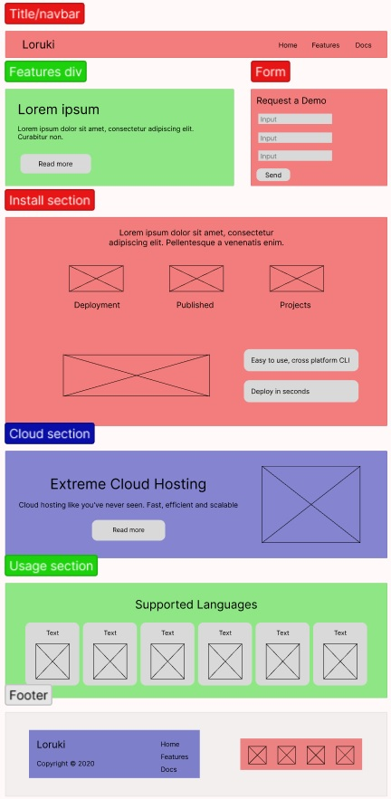
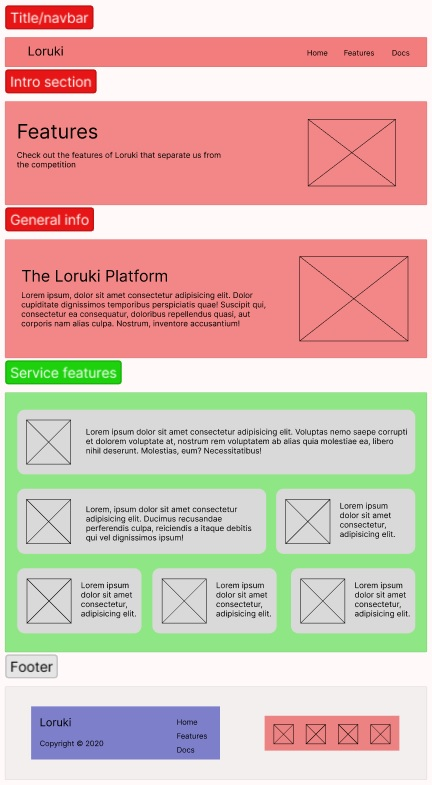
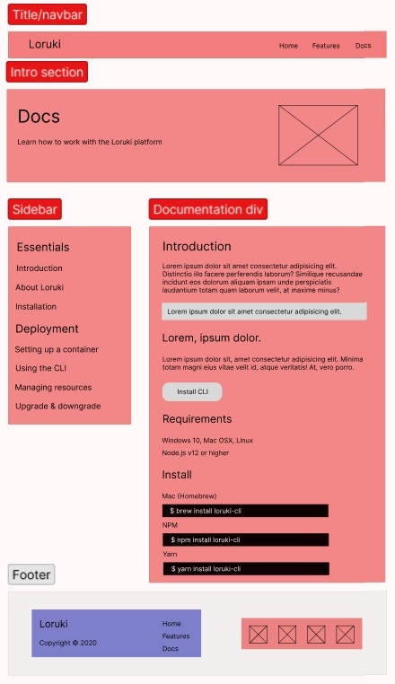

# Design

Below is a wireframe of the website. There are 3 pages: _**Home**_, which
contains general information; _**Features**_ where it explains what features the
system has; and _**Docs**_, which explains how to do things.

---

- Red elements - **must-haves**
- Green elements - **should-haves**
- Blue elements - **could-haves**

## Home

## Features

## Docs

