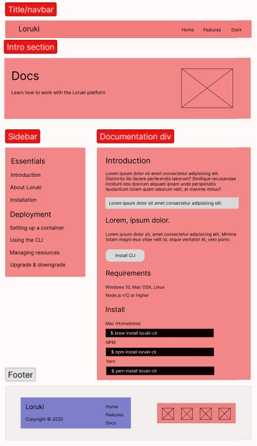

# Loruki Website

---

## Wireframe

Color legend:

- Red - **must-haves**
- Green - **should-haves**
- Blue - **could-haves**

## Home

## 1. Title Home

> As a user I can read the clear title of the website.

### - HTML -

- add `div` element with class name `navbar`
- inside the `div` add `h1` with `a` tag inside for the title of "Loruki"
- add class name `logo` to `h1`

### - CSS -

- add `background-color`
- add `color`
- add `height`

## 2. Navbar Home

> As a user I can navigate the web page from a navbar.

### - HTML -

- add `nav` element under `h1`
- add `ul` element with 3 `li` elements for Home, Features, and Docs nested
  inside `a` tags
- add links to each `a` tag:
  - `<a href="index.html">Home</a>`
  - `<a href="features.html">Features</a>`
  - `<a href="docs.html">Docs</a>`

### - CSS -

- set justify-content to `space-between` in class `navbar`
- set display to `flex` for `ul` element
- add `color` `padding` and `margin` to `a` elements
- add `hover` styling to `a` elements

## 3. Form Home

> As a user I am able to see the form to request a demo version of Loruki.

### - HTML -

- add a `div` with class name `showcase-form card`
- add `h2` with "Request a Demo" inside
- add `form` element
- add 3 `div`s with class name `form-control`
- add a required `input` field for Name, Company Name, and Email
- add button for submitting the form

### - CSS -

- set position as `relative`
- set justify-self as `flex-end`
- add `height`
- add `width`
- add `padding`
- add animation of `slideInFromRight 1s ease-in`
- add `width` `padding` and `font-size` to input fields

## 4. Install Section

> As a user I can see how to install Loruki.

### - HTML -

- add a `section` with class name `stats`
- add `h3` element with an intro to the platform
- add 3 `div`s for stats
- add `h3` elements for statistics numbers inside each `div`
- add `p` element under each `h3` for Deployment, Published, and Projects as
  each statistic topic- add a `section` with class name `cli`
- add `img` for instructions on how to install
- add 2 `h3` tags for facts inside a `div` with class name `card`

### - CSS -

- add `padding-top` for stats section
- set animation to `slideInFromBottom 1s ease-in` for stats section
- set margin for stats heading to `auto`
- position `img` on the left and cards on the right, stacked on top of each
  other

## 5. Footer Home

> As a user I am able to contact the creators of the Loruki website by clicking
> on the links for different platforms.

### - HTML -

- add `footer` element
- add `div` with class name `social`
- add 4 `a` tags for each social media platform

### - CSS -

- set margin for `a` tags to `0 10px`
- set colors for each social media platform

## Features

## 1. Title Features

> As a user I can read the clear title of the website.

### - HTML -

- add `div` element with class name `navbar`
- inside the `div` add `h1` with `a` tag inside for the title of "Loruki"
- add class name `logo` to `h1`

### - CSS -

- add `background-color`
- add `color`
- add `height`

## 2. Navbar Features

> As a user I can navigate the web page from a navbar.

### - HTML -

- add `nav` element under `h1`
- add `ul` element with 3 `li` elements for Home, Features, and Docs nested
  inside `a` tags
- add links to each `a` tag:
  - `<a href="index.html">Home</a>`
  - `<a href="features.html">Features</a>`
  - `<a href="docs.html">Docs</a>`

### - CSS -

- set justify-content to `space-between` in class `navbar`
- set display to `flex` for `ul` element
- add `color` `padding` and `margin` to `a` elements
- add `hover` styling to `a` elements

## 3. Page Title Features

> As a user I can read the clear `page title`.

### - HTML -

- Create a `<section>` tag with `<h1>` name of the page inside
- Inside the `<section>` also create `` with logo
- After `<h1>` add `
` with small description of the page

### - CSS -

- Position the elements with display:grid
- Define color: white, font-size, background-color
- Give width and height to a logo ``

## 4. Page Description

> As a user I am able to see the general info about Loruki.

### - HTML -

- Create a `<section>` tag with `<h1>`
- After `<h1>` add `
` with wide description of the page
- Inside the `<section>` also create `` with schema

### - CSS -

- Position the elements with display:grid
- Define color: gray, font-size, background-color
- Give width and height to an ``

## 5. Footer Features

> As a user I am able to contact the creators of the Loruki website by clicking
> on the links for different platforms.

### - HTML -

- add `footer` element
- add `div` with class name `social`
- add 4 `a` tags for each social media platform

### - CSS -

- set margin for `a` tags to `0 10px`
- set colors for each social media platform

## Docs

## 1. Title Docs

> As a user I can read the clear title of the website.

### - HTML -

- add `div` element with class name `navbar`
- inside the `div` add `h1` with `a` tag inside for the title of "Loruki"
- add class name `logo` to `h1`

### - CSS -

- add `background-color`
- add `color`
- add `height`

## 2. Navbar Docs

> As a user I can navigate the web page from a navbar.

### - HTML -

- add `nav` element under `h1`
- add `ul` element with 3 `li` elements for Home, Features, and Docs nested
  inside `a` tags
- add links to each `a` tag:
  - `<a href="index.html">Home</a>`
  - `<a href="features.html">Features</a>`
  - `<a href="docs.html">Docs</a>`

### - CSS -

- set justify-content to `space-between` in class `navbar`
- set display to `flex` for `ul` element
- add `color` `padding` and `margin` to `a` elements
- add `hover` styling to `a` elements

## 3. Page Title Docs

> As a user I can read the clear `page title`.

### - HTML -

- Create a `<section>` tag with `<h1>` name of the page inside
- Inside the `<section>` also create `` with logo
- After `<h1>` add `
` with small description of the page

### - CSS -

- Position the elements with display:grid
- Define color: white, font-size, background-color
- Give width and height to a logo ``

## 4. Sidebar

> As a user, I am able to navigate through different documentations

### - HTML -

- Create a `
` tag with unordered list `<ul>`
- Inside the `<ul` also create `<li>` for each sidebar item
- After in each `<li>` add `<a>` with the name of each sidebar item

### - CSS -

- Position the elements with display:grid
- Define color, font-size, background-color, border formatting
- Add shadow to the sidebar `
`

## 5. Main content

> As a user I can see the documentations depending on the sidebar links

### - HTML -

- Create a `
` tag with `<h2>` and several `
` for text
- Inside each `
` also create `
` and `<ul>`

### - CSS -

- Position the elements
- Define color, font-size, background-color for each element

## 6. Footer Docs

> As a user I am able to contact the creators of the Loruki website by clicking
> on the links for different platforms.

### - HTML -

- add `footer` element
- add `div` with class name `social`
- add 4 `a` tags for each social media platform

### - CSS -

- set margin for `a` tags to `0 10px`
- set colors for each social media platform
